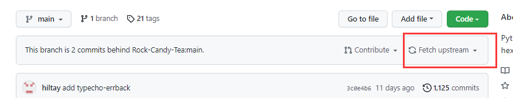

# 友链朋友圈

你是否经常烦恼于友链过多但没有时间浏览？那么友链朋友圈将解决这一痛点。你可以随时获取友链网站的更新内容，并了解友链的活跃情况 。

```
目前 release 4.1.2 版本：
- 支持 gitee 上的 issuse 友链获取
- 支持 github 上的 issuse 友链获取
- 支持 butterfly、volantis、matery、sakura、fluid主题的最新文章获取
- 新增目前最通用的atom和rss规则
- 支持站点屏蔽，在配置项选择开启
- 代码基于scrapy重构
- 支持更新时间和创建时间排序
- 支持未适配的hexo主题和非hexo用户使用，在配置项选择开启配置项友链
- 支持爬取typecho类型的博客
- 新增对nexmoe、Yun、stun主题的爬取
- 支持爬取wordpress类型的博客
- 优化文章去重规则
- 新增额外的友链页同时爬取，在配置项选择开启
- 新增对stellar主题的爬取
- 支持添加HTTP代理，在配置项选择开启
- 新增配置项友链选项，自定义订阅后缀和解析类型

bug修复：
- wordpress类型博客的时间格式问题
- butterfly主题友链页解析不再抓取背景图片了
- 修复了github和gitee对volantis主题的友链获取
- 屏蔽站点现在不计入失联数
```

# 版本更新

发布新版本后，您只需要在您fork的仓库点击fetch即可更新到最新版本。


如果觉得本项目不错，请帮忙点个⭐Star，既是对我们的支持，还可以随时关注友链朋友圈的更新情况。

ღ( ´･ᴗ･` )比心

# 相关链接
部署教程：https://noionion.top/47095.html

效果预览：https://noionion.top/friendcircle/

提交bug：https://www.yyyzyyyz.cn/posts/b30617f07b86/

前端样式：https://github.com/Akilarlxh/hexo-filter-fcircle


