# 后端部署

后端部署目前提供github，server，docker三种方式。

其中github为云端部署，server和docker需要您自备服务器。

## github部署

这是默认的部署方式，即：github+leancloud+vercel

整个部署均在云端完成。运行原理：

1. 通过github action启动爬虫抓取友链文章数据
2. 数据由爬虫推送至数据库保存（默认为leancloud，可以自行更改）
3. vercel部署的api从数据库获取数据交付给前端

### leancloud数据库搭建

前往[leancloud国际版官网](https://leancloud.app/)注册账号并登录。

前往[控制台](https://console.leancloud.app/apps)新建应用，应用名称无限制

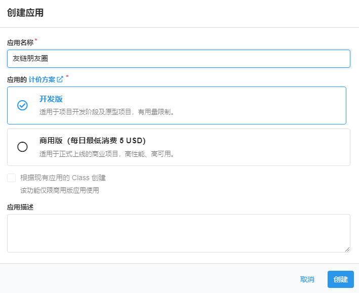

进入应用中，点击`设置-->应用凭证`，记录`AppID`和`AppKey`，后面会用到。

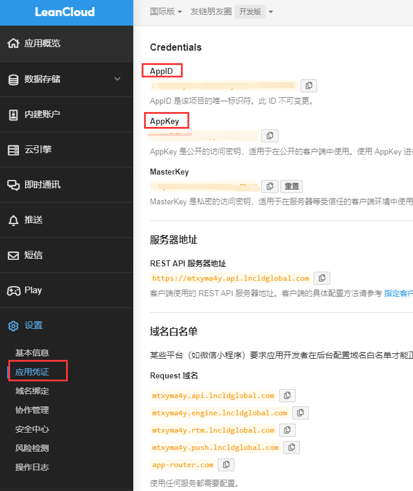

### github爬虫仓库部署及配置

fork友链朋友圈的项目仓库，地址：https://github.com/Rock-Candy-Tea/hexo-circle-of-friends

点击`fork`后仓库的`Settings-->Secrets-->New repository secret`

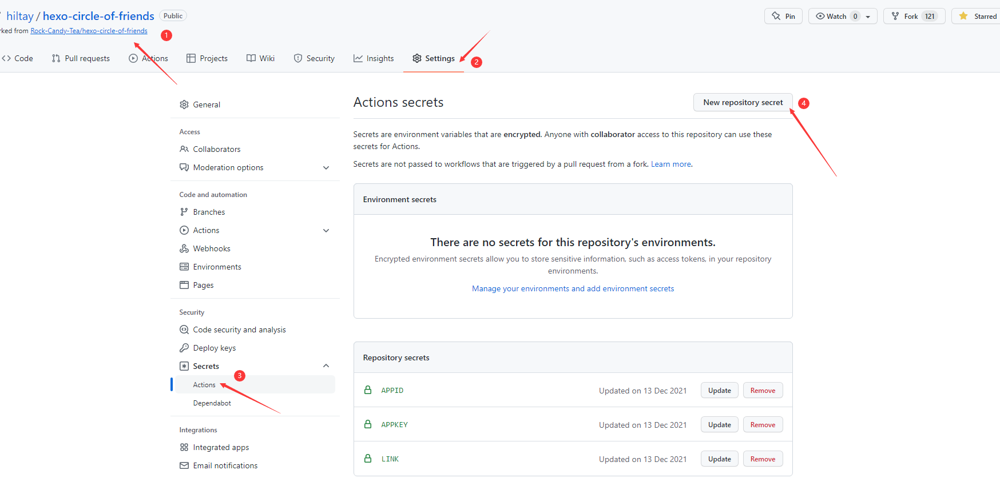

添加三个环境变量，其中：

- Name：分别为`APPID`、`APPKEY`、`LINK`
- Value：分别对应填入刚刚保存leancloud的`AppID`和`AppKey`，以及你的友链链接地址（例如 https://noionion.top/link/）


启用`fork`后仓库的github action，点击`Actions-->I understand my workflows, go ahead and enable them`

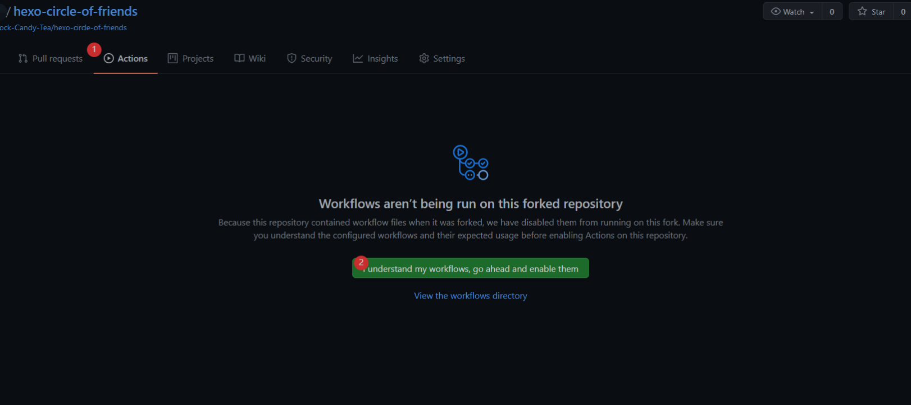

之后点击`update-friends-posts`并启用`workflow`

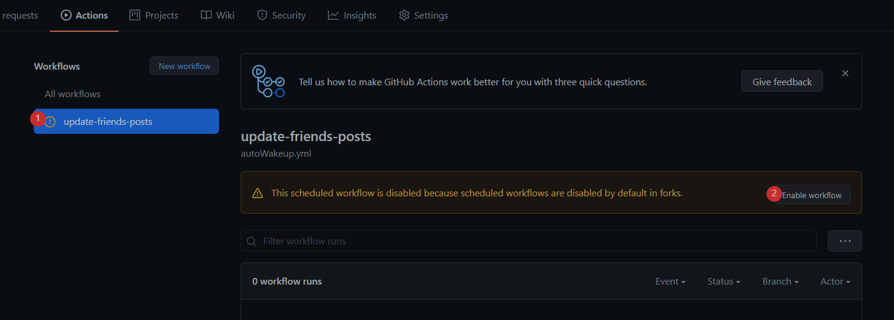

之后点击仓库`star`来完成第一次程序运行，不出意外的话结果如下图：

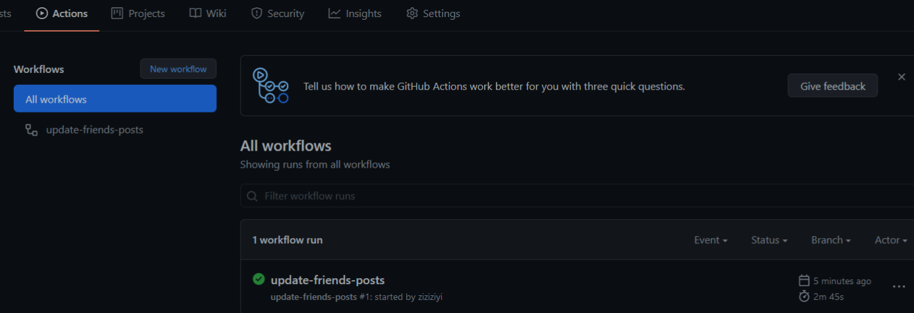

这时刚刚的leancloud上也能看到上传的数据。

此后在每天的0,6,12,18,21点整，都会自动启动爬虫进行爬取。

编辑仓库中的`/hexo_circle_of_friends/setting.py`文件，修改友链页的获取策略：

```python
FRIENDPAGE_STRATEGY={
    "strategy": "default",
    "theme": "butterfly"  # 请修改为您的主题
}
```

如需更换数据库，以及其它更多配置，详见配置项说明。

### vercel部署

前往[vercel官网](https://vercel.com/)，直接用github创建账号并用手机号绑定。

点击`New Project`新建项目

找到`Import Git Repository`，应该可以看见你刚刚`fork`的仓库，点击`Import`。

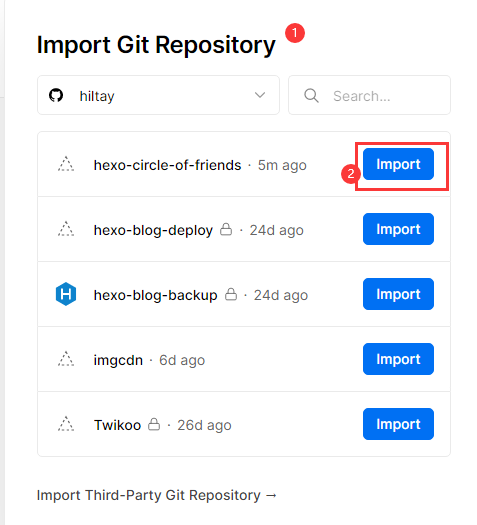

添加两个环境变量，其中：

- Name：分别为`APPID`、`APPKEY`
- Value：分别对应填入刚刚保存leancloud的`AppID`和`AppKey`

添加完成后，点击`Deploy`。

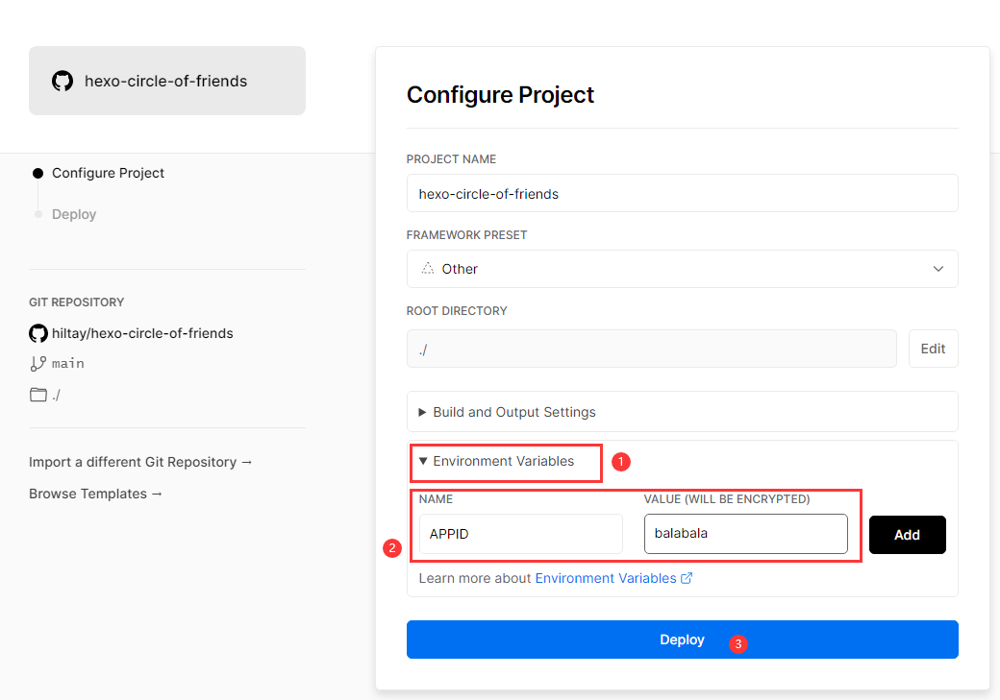

回到首页，等待一会，应该会部署完成，找到`DOMAINS`下面的地址，如：https://hexo-friendcircle4-api.vercel.app

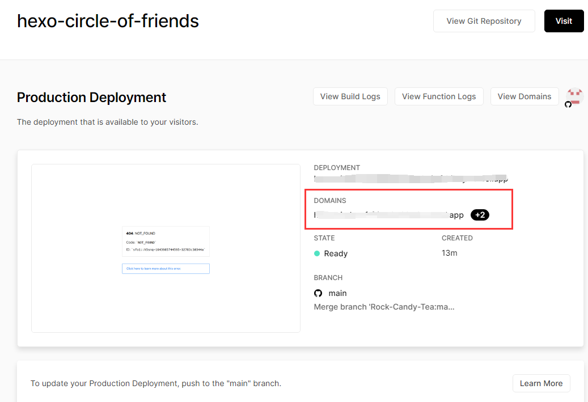

在这个地址后面拼接`/all`尝试访问，出现数据就说明配置成功。

## server部署

首先请确保你的服务器安装好python3.8环境和git，搭建过程：

安装依赖：

```bash
yum -y install zlib-devel bzip2-devel openssl-devel ncurses-devel sqlite-devel readline-devel tk-devel gdbm-devel db4-devel libpcap-devel xz-devel libffi-devel yum vim gcc git
```

安装python

```bash
wget https://www.python.org/ftp/python/3.8.8/Python-3.8.8.tgz
tar -zxf Python-3.8.8.tgz && cd Python-3.8.8
./configure --prefix=/usr/local/python3
make && make install
```

建立软连接

```bash
ln -s /usr/local/python3/bin/python3.8 /usr/bin/python3
ln -s /usr/local/python3/bin/pip3.8 /usr/bin/pip3
```

验证：

```bash
python3 --version
```

出现版本号即安装成功。

运行原理：

1. 启动爬虫抓取友链文章数据
2. 数据由爬虫推送至数据库保存（默认为leancloud，可以自行更改）
3. vercel（或者服务器）部署的api从数据库获取数据交付给前端

部署方法：

fork友链朋友圈的项目仓库，地址：https://github.com/Rock-Candy-Tea/hexo-circle-of-friends

在`fork`后仓库中，编辑仓库中的`/hexo_circle_of_friends/setting.py`文件，必须修改的配置如下：

```python
FRIENDPAGE_STRATEGY={
    "strategy": "default",
    "theme": "butterfly"  # 请修改为您的主题
}

DEPLOY_TYPE = "server"
```

如需更换数据库，以及其它更多配置，详见配置项说明。

然后编辑仓库中的`server.sh`文件，将`LINK`修改为你的友链链接地址，将`EXPOSE_PORT`修改为你想要对外暴露的端口号，以及：

- 如果数据库使用leancloud，请添加`APPID`和`APPKEY`
- 如果数据库使用mysql，请添加登录用户名`MYSQL_USERNAME`，登录密码`MYSQL_PASSWORD`，数据库IP地址`MYSQL_IP`，要连接到的库的名称`MYSQL_DB`
- 如果数据库使用sqlite，不需要配置

修改完成后，登录进入你的服务器，依次执行：

`clone`你的仓库，进入仓库添加脚本执行权限

```bash
git clone https://github.com/balabala/hexo-circle-of-friends
cd hexo-circle-of-friends/
chmod a+x server.sh
./server.sh
```

部署完毕，服务器上开始运行两个进程，一个是爬虫程序，另一个是api服务。

尝试访问API：

```bash
curl 127.0.0.1:8000/all
```

出现数据即为部署成功。

接下来，开放服务器的对应端口（我这里是8000），就可以通过`IP:端口`或者`域名:端口`访问到API，也可以通过配置反向代理，转发到网站的80端口下。

如果需要关闭爬虫和api，需要找到其进程号

```bash
ps aux
```

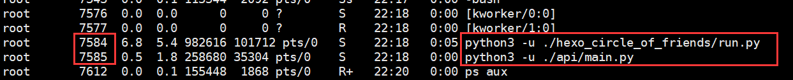

杀掉对应的进程即可

```bash
kill -9 7584
kill -9 7585
```

## docker部署

运行原理：

1. 通过Dockerfile构建自定义镜像
2. 启动容器，容器内爬虫抓取友链文章数据
3. 数据由爬虫推送至数据库保存（默认为leancloud，可以自行更改）
4. api从数据库获取数据交付给前端

部署方法：

fork友链朋友圈的项目仓库，地址：https://github.com/Rock-Candy-Tea/hexo-circle-of-friends

在`fork`后仓库中，编辑仓库中的`/hexo_circle_of_friends/setting.py`文件，必须修改的配置如下：

```python
FRIENDPAGE_STRATEGY={
    "strategy": "default",
    "theme": "butterfly"  # 请修改为您的主题
}

DEPLOY_TYPE = "docker"
```

如需更换数据库，以及其它更多配置，详见配置项说明。

然后编辑仓库中的`/Dockerfile`文件，将`LINK`修改为你的友链链接地址，以及：

- 如果数据库使用leancloud，请添加`APPID`和`APPKEY`
- 如果数据库使用mysql，请添加登录用户名`MYSQL_USERNAME`，登录密码`MYSQL_PASSWORD`，数据库IP地址`MYSQL_IP`，要连接到的库的名称`MYSQL_DB`
- 如果数据库使用sqlite，不需要配置

```dockerfile
FROM python:3.8
MAINTAINER yyyz
COPY . /
### 通用配置
ENV LINK="https://www.yyyzyyyz.cn/link/"
# ENV PROXY=""
### leancloud配置
ENV APPID=""
ENV APPKEY=""
### mysql配置
#ENV MYSQL_USERNAME=""
#ENV MYSQL_PASSWORD=""
#ENV MYSQL_IP=""
#ENV MYSQL_DB=""
EXPOSE 8000
WORKDIR /
RUN cd ./hexo_circle_of_friends && pip3 install -r requirements.txt
CMD bash ./start.sh
```

修改完成后，登录进入你的服务器（前提是已经安装好docker和git），依次执行：

`clone`你的仓库，进入仓库构建镜像

```bash
git clone https://github.com/balabala/hexo-circle-of-friends
cd hexo-circle-of-friends/
docker build -t fcircle .
```

等待构建完成后，创建容器：

```bash
docker run -di -p [port]:8000 fcircle
# 其中 [port] 替换为你需要开放的端口，比如：
docker run -di -p 8000:8000 fcircle
```

输入`docker ps`查看创建情况：

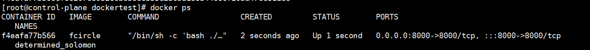

尝试访问API：

```bash
curl 127.0.0.1:8000/all
```

出现数据即为部署成功。

接下来，开放服务器的对应端口（我这里是8000），就可以通过`IP:端口`或者`域名:端口`访问到API，也可以通过配置反向代理，转发到网站的80端口下。

